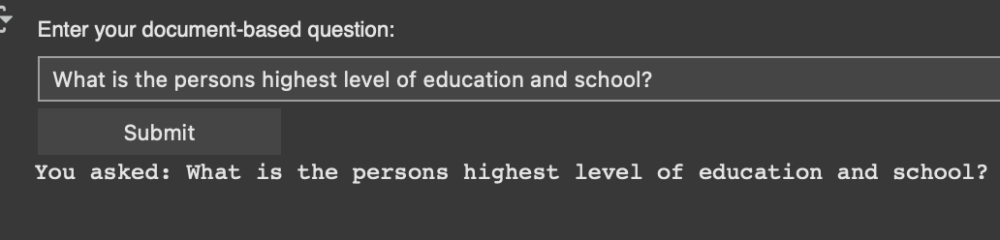

# 🧠 Retrieval-Augmented Generation (RAG): A Practical Walkthrough

**Author:** Dan Harvey  
📧 dan [at] danielyusay.com  
📧 daniel.harvey [at] columbia.edu  

This notebook offers a hands-on, functional walkthrough of a simplified Retrieval-Augmented Generation (RAG) system — blending document-based retrieval with structured prompting to enable grounded, explainable outputs from an LLM.

> ⚠️ This is a learning prototype intended for simple and practical understanding to RAG — not a production-grade system. This is designed as a one-off document supplementation and not a full document - > embedding - > vector db like RAG systems.

---

## 🚀 What This Notebook Covers

This demo simulates a basic RAG-style inference loop for answering natural language questions based on user-provided documents (e.g., PDF resumes).

### 🔄 Workflow

1. **User Prompt**
   - Accepts natural language questions via an input field.
   - 

2. **Upload Reference Document**  
   - Supports `.txt` and `.pdf` formats  
   - Parses and preprocesses content for retrieval
   - 
     
3. **Prompt + Context → LLM**  
   - Injects both user prompt and relevant document content into a structured template  
   - Uses a local LLM (`Qwen3-4B`) for generation

4. **Answer / Inference Output**  
   - Returns structured answers with citation-style justification  
   - Optional: Explains reasoning before providing a final answer
   - 

---

## 📌 Example Use Case

In this notebook, we demonstrate this using a sample resume and asking questions like:

> "Where did this person go to school?"

---

## 📂 Files

- `Practical_RAG.ipynb` — the main interactive notebook
- `sample_resume.pdf` — example reference document used for inference

---

## 🛠 Requirements

This was written for **Google Colab** with:
- Transformers (`transformers>=4.35`)
- PyTorch
- `PyMuPDF` (`fitz`) for PDF parsing
- `ipython`, `ipywidgets` for interactive UI

---

## 📚 References

- [Pinecone Documentation – Guides](https://docs.pinecone.io/guides/)
- [Billion-scale similarity search with GPUs (FAISS)](https://arxiv.org/abs/2005.11401)
- [FAISS: Facebook Engineering Blog](https://engineering.fb.com/2017/03/29/data-infrastructure/faiss-a-library-for-efficient-similarity-search/)
- [Mistral Cookbook – basic_RAG.ipynb](https://github.com/mistralai/cookbook/blob/main/mistral/rag/basic_RAG.ipynb)

---

## 🙏 Acknowledgments

This project was inspired by the [Mistral RAG examples](https://github.com/mistralai/cookbook).  
Feel free to fork, extend, or suggest improvements!

---

## 🧪 Disclaimer

This is a prototype. If you're building a production-ready RAG system, consider:
- Vector DBs (e.g., Pinecone, Weaviate, FAISS)
- Token-aware chunking
- Retrieval optimization (semantic search, reranking)
- Streaming generation & feedback integration

